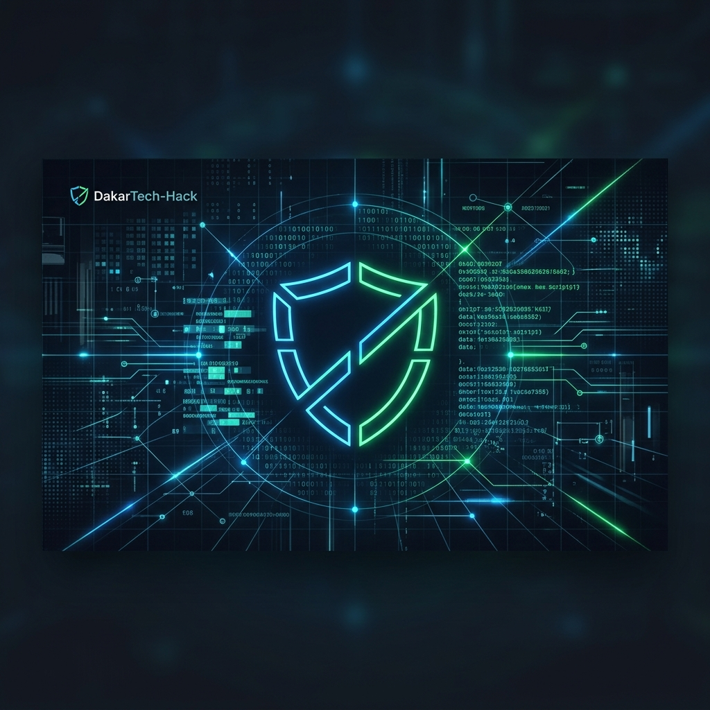

# DakarTech-Hack - Community Learning & CTF Platform



## Présentation du Projet
**DakarTech-Hack** est une plateforme communautaire dédiée à l'apprentissage de la cybersécurité et à la pratique via des challenges **CTF (Capture The Flag)**. Conçu comme un projet de fin de semestre, ce système complet permet aux passionnés de s'entraîner, de partager des connaissances et de se mesurer aux autres dans un environnement sécurisé et compétitif.

L'objectif est de dynamiser l'élite de la cybersécurité au Sénégal en offrant des ressources de formation, un forum de discussion et une arène de compétition technique.

---

## Fonctionnalités Principales

### Plateforme CTF (Capture The Flag)
- **Challenges Multi-catégories** : Web, Cryptographie, Reverse Engineering, PWN, Réseau, OSINT & Forensics.
- **Validation Automatisée** : Système de soumission de flags avec vérification en temps réel.
- **Leaderboard Dynamique** : Classement des participants basé sur les points accumulés et la rapidité de résolution.
- **Progression Utilisateur** : Suivi des statistiques personnelles et des défis relevés.

### Communauté & Collaboration
- **Forum de Discussion** : Espace dédié pour poser des questions, partager des write-ups et collaborer.
- **Système de Chat** : Communication en temps réel avec gestion de "likes" et réponses.
- **Réseau de Mentors** : Accès à une équipe d'experts pour accompagner l'apprentissage.

### Administration & Gestion
- **Dashboard Admin Complet** : Gestion des utilisateurs (Membres, Mentors, Admins, Superadmins).
- **Gestion des Contenus** : Publication d'actualités, ajout de nouveaux challenges CTF et gestion des membres de l'équipe.
- **Sécurité** : Authentification robuste (hachage de mots de passe, gestion de tokens).

---

## Stack Technique

### Frontend
- **HTML5 & CSS3** : Design moderne avec effets de "glow", orbes dynamiques et typographie **Orbitron**.
- **JavaScript (Vanilla)** : Interactions fluides, gestion des particules et appels API asynchrones.
- **Responsive Design** : Adapté aux écrans desktop et mobiles.

### Backend
- **PHP 8+** : Architecture modulaire avec un contrôleur frontal pour l'API REST.
- **MySQL / MariaDB** : Base de données relationnelle structurée pour la persistance des données.
- **PDO** : Utilisation de requêtes préparées pour prévenir les injections SQL.

---

## Structure du Projet
```
.
├── BACK-END/
│   ├── public/         # Point d'entrée de l'API (index.php)
│   ├── src/            # Logique métier (Auth, DB, HTTP)
│   ├── database/       # Scripts SQL et modèles de données
│   └── config/         # Configuration du serveur
├── FRONT-END/
│   ├── index.html      # Accueil du site
│   ├── ctfs.html       # Arène de compétition
│   ├── forum.html      # Espace communautaire
│   ├── style.css       # Design global (cyberpunk style)
│   └── ...             # Autres pages applicatives
└── README.md           # Documentation du projet
```

---

## Installation & Configuration

### Prérequis
- Un serveur web (Apache/Nginx) avec **PHP 8.0** ou supérieur.
- Un serveur de base de données **MySQL**.

### Étapes d'installation
1. **Clonage du dépôt** :
   ```bash
   git clone https://github.com/votre-compte/DakarTech-Hack.git
   ```
2. **Configuration de la Base de Données** :
   - Créez une base de données MySQL.
   - Importez le fichier `BACK-END/database/schema.sql`.
   - Modifiez les accès dans `BACK-END/src/db.php`.
3. **Initialisation** :
   - Exécutez le script `BACK-END/init_db.php` pour peupler les données initiales.
4. **Lancement** :
   - Configurez votre serveur web pour pointer sur le dossier racine ou utilisez le serveur de développement PHP.

---

## Équipe & Crédits
Ce projet a été réalisé par **Deo** dans le cadre de l'examen de fin de semestre. 

- **Concept & Design** : Deo
- **Développement Backend** : Deo
- **Développement Frontend** : Deo

---

## Licence
Ce projet est sous licence MIT. Voir le fichier `LICENSE` pour plus de détails.
