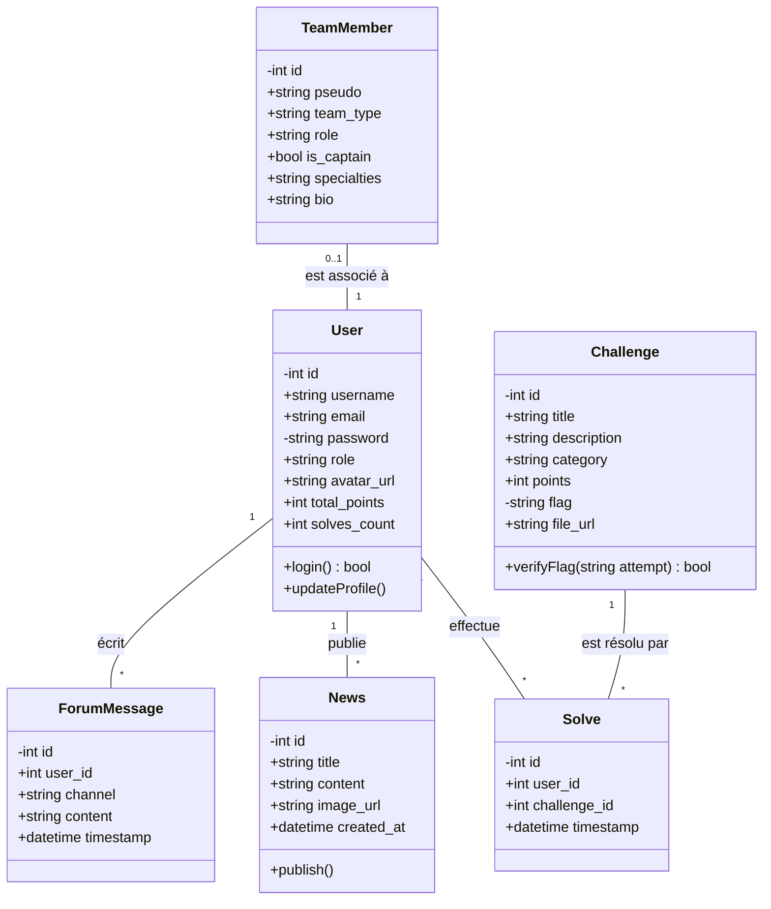

# Documentation UML — Plateforme DakarTech-Hack

Ce document présente l'architecture fonctionnelle et structurelle de la plateforme. Les diagrammes respectent les normes universelles **UML 2.x**.

---

## 1. Diagramme de Cas d'Utilisation Global

Ce diagramme présente une vue d'ensemble des interactions entre les différents acteurs et le système.

![Diagramme Global](https://mermaid.ink/img/dXNlQ2FzZURpYWdyYW0KICAgIGFjdG9yICJWaXNpdGV1ciIgYXMgVgogICAgYWN0b3IgIk1lbWJyZSAoSGFja2VyKSIgYXMgTQogICAgYWN0b3IgIk1lbnRvciIgYXMgTWVudG9yCiAgICBhY3RvciAiQWRtaW5pc3RyYXRldXIiIGFzIEFkbWluCiAgICBhY3RvciAiU3VwZXJhZG1pbiIgYXMgU0FkbWluCgogICAgcGFja2FnZSAiUGxhdGVmb3JtZSBEYWthclRlY2gtSGFjayIgewogICAgICAgIHVzZWNhc2UgIlMnaW5zY3JpcmUgLyBDb25uZXhpb24iIGFzIFVDMQogICAgICAgIHVzZWNhc2UgIkNvbnN1bHRlciBsZXMgQWN0dWFsaXTDqXMiIGFzIFVDMgogICAgICAgIHVzZWNhc2UgIlBhcmNvdXJpciBsZSBGb3J1bSIgYXMgVUMzCiAgICAgICAgdXNlY2FzZSAiUGFydGljaXBlciBhdSBDaGF0IiBhcyBVQzQKICAgICAgICB1c2VjYXNlICJSw6lzb3VkcmUgdW4gQ2hhbGxlbmdlIENURiIgYXMgVUM1CiAgICAgICAgdXNlY2FzZSAiQ29uc3VsdGVyIGxlIExlYWRlcmJvYXJkIiBhcyBVQzYKICAgICAgICB1c2VjYXNlICJBY2PDqGRlciBhdSBEYXNoYm9hcmQiIGFzIFVDNwogICAgICAgIHVzZWNhc2UgIlB1YmxpZXIgZGVzIE5ld3MvUmVzc291cmNlcyIgYXMgVUM4CiAgICAgICAgdXNlY2FzZSAiR8OpcmVyIGxlcyBVdGlsaXNhdGV1cnMiIGFzIFVDOQogICAgICAgIHVzZWNhc2UgIkfDqXJlciBsZXMgQ2hhbGxlbmdlcy9DVEYiIGFzIFVDMTAKICAgICAgICB1c2VjYXNlICJHw6lyZXIgbGVzIMOIcXVpcGVzIFN0YWZmIiBhcyBVQzExCiAgICAgICAgdXNlY2FzZSAiQWNjZXMgbm8gU3RhdGlzdGlxdWVzIEdsb2JhbGVzIiBhcyBVQzEyCiAgICAgICAgdXNlY2FzZSAiR8OpcmVyIGxlcyBBZG1pbmlzdHJhdGV1cnMiIGFzIFVDMTMKICAgIH0KCiAgICBWIC0tPiBVQzEKICAgIFYgLS0+IFVDMgogICAgCiAgICBNIC0t|>IFYKICAgIE0gLS0+IFVDMwogICAgTSAtLT4gVUM0CiAgICBNIC0tPiBVQzUKICAgIE0gLS0+IFVDNgogICAgTSAtLT4gVUM3CgogICAgTWVudG9yIC0t|>IE0KICAgIE1lbnRvciAtLT4gVUM4CgogICAgQWRtaW4gLS0|>IE1lbnRvcgogICAgQWRtaW4gLS0+IFVDOQogICAgQWRtaW4gLS0+IFVDMTAKICAgIEFkbWluIC0tPiBVQzExCiAgICBBZG1pbiAtLT4gVUMxMgoKICAgIFNBZG1pbiAtLT|>IEFkbWluCiAgICBTQWRtaW4gLS0+IFVDMTMK)

<details>
<summary>Voir le code source Mermaid</summary>

```mermaid
useCaseDiagram
    actor "Visiteur" as V
    actor "Membre (Hacker)" as M
    actor "Mentor" as Mentor
    actor "Administrateur" as Admin
    actor "Superadmin" as SAdmin

    package "Plateforme DakarTech-Hack" {
        usecase "S'inscrire / Connexion" as UC1
        usecase "Consulter les Actualités" as UC2
        usecase "Parcourir le Forum" as UC3
        usecase "Participer au Chat" as UC4
        usecase "Résoudre un Challenge CTF" as UC5
        usecase "Consulter le Leaderboard" as UC6
        usecase "Accéder au Dashboard" as UC7
        usecase "Publier des News/Ressources" as UC8
        usecase "Gérer les Utilisateurs" as UC9
        usecase "Gérer les Challenges/CTF" as UC10
        usecase "Gérer les Équipes Staff" as UC11
        usecase "Accès Statistiques Globales" as UC12
        usecase "Gérer les Administrateurs" as UC13
    }

    V --> UC1
    V --> UC2
    
    M --|> V
    M --> UC3
    M --> UC4
    M --> UC5
    M --> UC6
    M --> UC7

    Mentor --|> M
    Mentor --> UC8

    Admin --|> Mentor
    Admin --> UC9
    Admin --> UC10
    Admin --> UC11
    Admin --> UC12

    SAdmin --|> Admin
    SAdmin --> UC13
```
</details>

---

## 2. Diagrammes Thématiques (Détails)

### A. Sous-système : Apprentissage & CTF


<details>
<summary>Voir le code source Mermaid</summary>

```mermaid
useCaseDiagram
    actor "Membre" as M
    
    package "Module CTF" {
        usecase "Lister les catégories" as UC_List
        usecase "Ouvrir un challenge" as UC_Open
        usecase "Soumettre un Flag" as UC_Flag
        usecase "Vérifier le Flag" as UC_Check
        usecase "Mettre à jour les points" as UC_Points
        usecase "Consulter les statistiques" as UC_Stats
    }

    M --> UC_List
    M --> UC_Open
    M --> UC_Flag
    M --> UC_Stats

    UC_Flag ..> UC_Check : <<include>>
    UC_Check ..> UC_Points : <<include>>
```
</details>

### B. Sous-système : Communauté & Forum


<details>
<summary>Voir le code source Mermaid</summary>

```mermaid
useCaseDiagram
    actor "Membre" as M
    
    package "Module Social/Forum" {
        usecase "Consulter les salons" as UC_ChatView
        usecase "Envoyer un message" as UC_Msg
        usecase "Supprimer son message" as UC_Del
        usecase "Modérer les messages" as UC_Mod
    }

    actor "Modérateur/Admin" as Admin

    M --> UC_ChatView
    M --> UC_Msg
    M --> UC_Del
    Admin --> UC_Mod
    UC_Mod ..> UC_Del : <<extend>>
```
</details>

---

## 3. Diagramme de Classes Technique

![Diagramme de Classes](https://mermaid.ink/img/Y2xhc3NEaWFncmFtCiAgICBjbGFzcyBVc2VyIHsKICAgICAgICAtaW50IGlkCiAgICAgICAgK3N0cmluZyB1c2VybmFtZQogICAgICAgICtzdHJpbmcgZW1haWwKICAgICAgICAtc3RyaW5nIHBhc3N3b3JkCiAgICAgICAgK3N0cmluZyByb2xlCiAgICAgICAgK3N0cmluZyBhdmF0YXJfdXJsCiAgICAgICAgK2ludCB0b3RhbF9wb2ludHMKICAgICAgICAraW50IHNvbHZlc19jb3VudAogICAgICAgICtsb2dpbigpIGJvb2wKICAgICAgICArdXBkYXRlUHJvZmlsZSgpCiAgICB9CgogICAgY2xhc3MgQ2hhbGxlbmdlIHsKICAgICAgICAtaW50IGlkCiAgICAgICAgK3N0cmluZyB0aXRsZQogICAgICAgICtzdHJpbmcgZGVzY3JpcHRpb24KICAgICAgICArc3RyaW5nIGNhdGVnb3J5CiAgICAgICAgK2ludCBwb2ludHMKICAgICAgICAtc3RyaW5nIGZsYWcKICAgICAgICArc3RyaW5nIGZpbGVfdXJsCiAgICAgICAgK3ZlcmlmeUZsYWcoc3RyaW5nIGF0dGVtcHQpIGJvb2wKICAgIH0KCiAgICBjbGFzcyBOZXdzIHsKICAgICAgICAtaW50IGlkCiAgICAgICAgK3N0cmluZyB0aXRsZQogICAgICAgICtzdHJpbmcgY29udGVudAogICAgICAgICtzdHJpbmcgaW1hZ2VfdXJsCiAgICAgICAgK2RhdGV0aW1lIGNyZWF0ZWRfYXQKICAgICAgICArcHVibGlzaCgpCiAgICB9CgogICAgY2xhc3MgVGVhbU1lbWJlciB7CiAgICAgICAgLWludCBpZAogICAgICAgICtzdHJpbmcgcHNldWRvCiAgICAgICAgK3N0cmluZyB0ZWFtX3R5cGUKICAgICAgICArc3RyaW5nIHJvbGUKICAgICAgICArYm9vbCBpc19jYXB0YWluCiAgICAgICAgK3N0cmluZyBzcGVjaWFsdGllcwogICAgICAgICtzdHJpbmcgYmlvCiAgICB9CgogICAgY2xhc3MgRm9ydW1NZXNzYWdlIHsKICAgICAgICAtaW50IGlkCiAgICAgICAgK2ludCB1c2VyX2lkCiAgICAgICAgK3N0cmluZyBjaGFubmVsCiAgICAgICAgK3N0cmluZyBjb250ZW50CiAgICAgICAgK2RhdGV0aW1lIHRpbWVzdGFtcAogICAgfQoKICAgIGNsYXNzIFNvbHZlIHsKICAgICAgICAtaW50IGlkCiAgICAgICAgK2ludCB1c2VyX2lkCiAgICAgICAgK2ludCBjaGFsbGVuZ2VfaWQKICAgICAgICArZGF0ZXRpbWUIHRpbWVzdGFtcAogICAgfQoKICAgIFVzZXIgIjEiIC0tICIqIiBGb3J1bU1lc3NhZ2UgOiDDqWNyaXQKICAgIFVzZXIgIjEiIC0tICIqIiBOZXdzIDogcHVibGllCiAgICBVc2VyICIxIiAtLSAiKiIgU29sdmUgOiBlZmZlY3R1ZQogICAgQ2hhbGxlbmdlICIxIiAtLSAiKiIgU29sdmUgOiBlc3QgcsOpc29sdSBwYXIKICAgIFRlYW1NZW1iZXIgIjAuLjEiIC0tICIxIiBVc2VyIDogZXN0IGFzc29jacOpIMOg)

<details>
<summary>Voir le code source Mermaid</summary>


</details>

---

### 📏 Respect des normes UML 2.x
- **Cas d'Utilisation** : Respect des frontières du système et distinction claire entre `include` (obligatoire) et `extend` (optionnel).
- **Classes** : 
    - **Encapsulation** : Utilisation de `-` pour les données sensibles (password, flag, ids) et `+` pour les données publiques.
    - **Relations** : Utilisation correcte des associations avec multiplicités (`1..*`, `0..1`).
    - **Méthodes** : Inclusion des opérations principales de gestion des flux.

---
*Documentation générée par Antigravity — Standard Universel UML*
