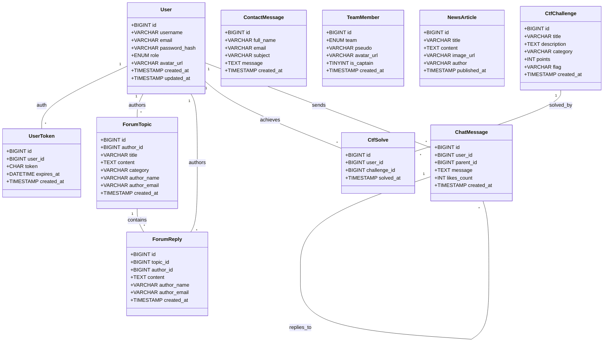

# Diagramme de Classes du Site

Le backend étant majoritairement procédural sous PHP (avec des fonctions simples et une connexion PDO), la logique applicative repose sur le modèle de la base de données relationnelle. Le diagramme de classes suivant modélise le "Modèle de Données" (Entités) déduit des tables SQL du site :

